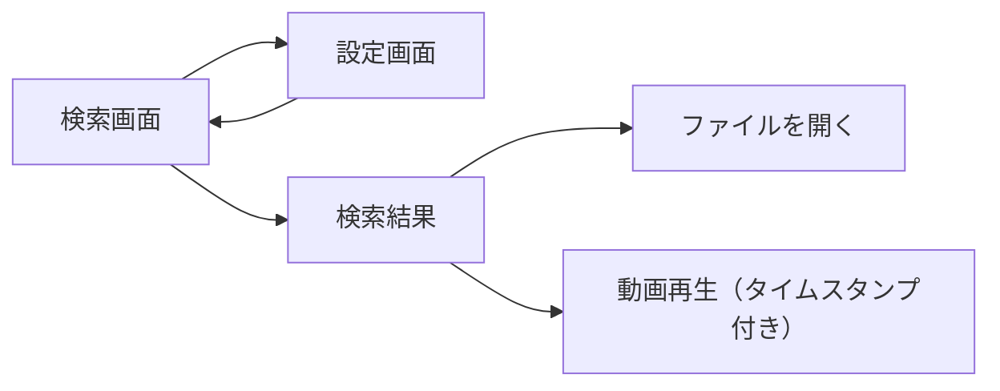

# サイトマップ・画面設計

## 画面一覧

| 画面 | パス | 説明 |
|------|------|------|
| 検索 | / | メイン検索画面 |
| 設定 | /settings | 設定画面 |

## 画面遷移図



## 検索画面 (/)

### レイアウト

```
+--------------------------------------------------+
|  LocalDocSearch                    [Settings]    |
+--------------------------------------------------+
|                                                  |
|  +--------------------------------------------+  |
|  |  検索...                              [🔍] |  |
|  +--------------------------------------------+  |
|                                                  |
|  [All] [Documents] [Images] [Videos] [Audio]     |
|                                                  |
|  +--------------------------------------------+  |
|  | 📄 report.pdf                              |  |
|  | ~/Documents/work/report.pdf                |  |
|  | ...検索にマッチしたテキスト...              |  |
|  | Score: 0.85  |  2024-01-15                  |  |
|  +--------------------------------------------+  |
|                                                  |
|  +--------------------------------------------+  |
|  | 🎬 meeting.mp4                   [▶ 1:23]  |  |
|  | ~/Movies/meetings/meeting.mp4              |  |
|  | ...発言内容...                              |  |
|  | Score: 0.78  |  2024-01-10                  |  |
|  +--------------------------------------------+  |
|                                                  |
+--------------------------------------------------+
```

### 機能

- 検索バー（リアルタイム検索）
- メディアタイプフィルター
- 検索結果カード
  - ファイルアイコン（タイプ別）
  - ファイル名・パス
  - マッチしたテキスト（ハイライト付き）
  - スコア・日付
  - 動画・音声: タイムスタンプ付き再生ボタン

### インタラクション

| アクション | 動作 |
|-----------|------|
| 検索入力 | 300msデバウンス後に検索実行 |
| 結果クリック | ファイルをデフォルトアプリで開く |
| タイムスタンプクリック | 指定位置から再生開始 |

## 設定画面 (/settings)

### レイアウト

```
+--------------------------------------------------+
|  [← 戻る]  Settings                              |
+--------------------------------------------------+
|                                                  |
|  監視ディレクトリ                                 |
|  +--------------------------------------------+  |
|  | ✓ ~/Documents                              |  |
|  | ✓ ~/Downloads                              |  |
|  | ✓ ~/Pictures                               |  |
|  | + ディレクトリを追加                         |  |
|  +--------------------------------------------+  |
|                                                  |
|  インデックス状態                                 |
|  +--------------------------------------------+  |
|  | ドキュメント: 5,000                         |  |
|  | 画像: 3,000                                 |  |
|  | 動画: 1,500                                 |  |
|  | 音声: 500                                   |  |
|  | 合計チャンク: 50,000                         |  |
|  | 最終更新: 2024-01-15 12:00                  |  |
|  +--------------------------------------------+  |
|                                                  |
|  [再インデックス実行]                             |
|                                                  |
+--------------------------------------------------+
```

### 機能

- 監視ディレクトリの追加・削除
- インデックス状態表示
- 手動再インデックス実行

## コンポーネント構成

```
ui/src/
├── routes/
│   ├── +page.svelte          # 検索画面
│   ├── +layout.svelte        # 共通レイアウト
│   └── settings/
│       └── +page.svelte      # 設定画面
├── lib/
│   ├── components/
│   │   ├── SearchBar.svelte
│   │   ├── ResultCard.svelte
│   │   ├── FilterPanel.svelte
│   │   ├── MediaPreview.svelte
│   │   └── TimestampPlayer.svelte
│   ├── stores/
│   │   └── search.ts
│   └── api.ts
└── app.css
```
