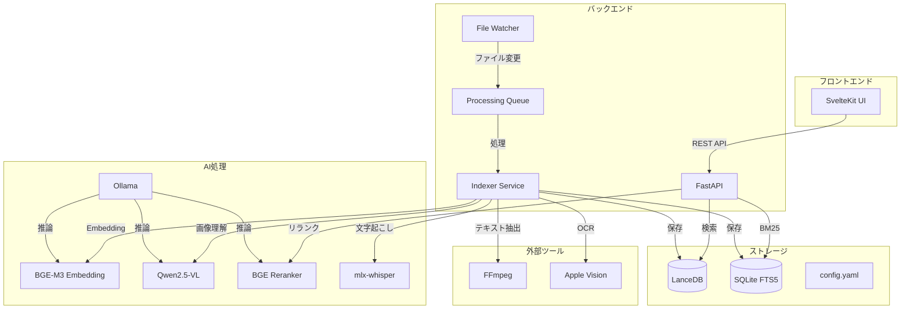
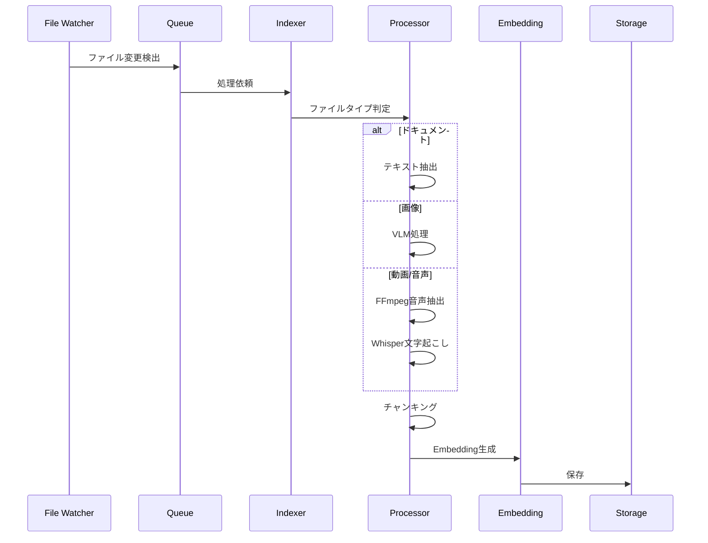
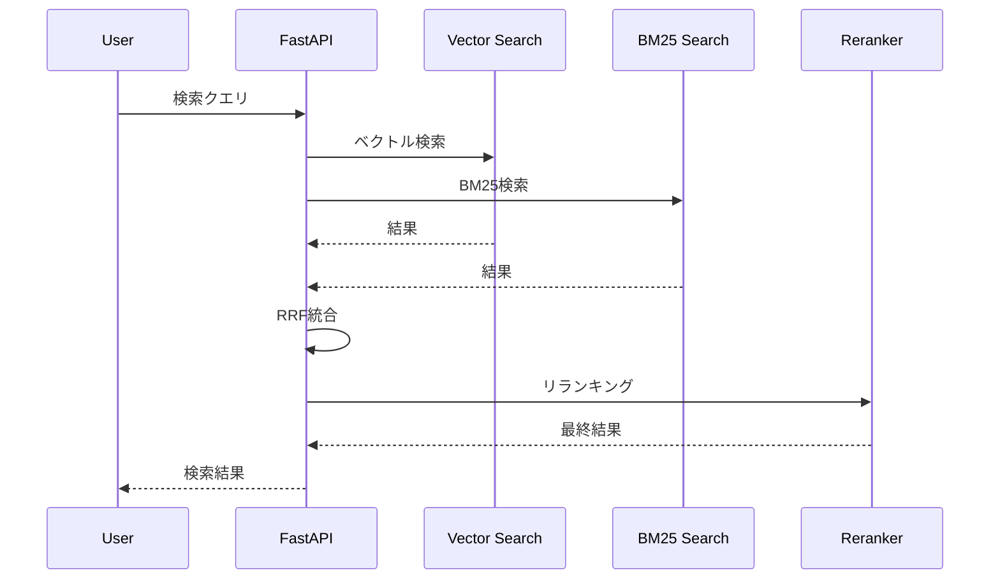

# アーキテクチャ

## システム構成図



## コンポーネント

### フロントエンド

| コンポーネント | 技術 | 役割 |
|--------------|------|------|
| Web UI | SvelteKit | 検索インターフェース |

### バックエンド

| コンポーネント | 技術 | 役割 |
|--------------|------|------|
| API | FastAPI | REST API提供 |
| Watcher | watchdog | ファイル監視 |
| Queue | 独自実装 | 処理キュー管理 |
| Indexer | 独自実装 | インデックス処理 |

### AI処理

| コンポーネント | モデル | 役割 |
|--------------|--------|------|
| Embedding | BGE-M3 | ベクトル生成 |
| VLM | Qwen2.5-VL:7B | 画像理解 |
| Reranker | bge-reranker-v2-m3 | 検索精度向上 |
| 音声認識 | whisper-large-v3-turbo | 文字起こし |

### ストレージ

| コンポーネント | 技術 | 役割 |
|--------------|------|------|
| ベクトルDB | LanceDB | ベクトル検索 |
| 全文検索 | SQLite FTS5 | BM25検索 |

## 処理フロー

### インデックス処理



### 検索処理



## ディレクトリ構成

```
local-doc-search/
├── src/
│   ├── config/          # 設定管理
│   ├── indexer/         # インデックス処理
│   ├── processors/      # ファイル処理
│   ├── transcription/   # 音声認識
│   ├── ocr/             # OCR
│   ├── embeddings/      # Embedding
│   ├── storage/         # DB操作
│   ├── search/          # 検索
│   ├── api/             # REST API
│   └── cli/             # CLI
├── ui/                  # SvelteKit
├── data/                # データ
├── scripts/             # スクリプト
├── tests/               # テスト
└── docs/                # ドキュメント
```

## セキュリティ

- **完全ローカル処理**: 外部通信なし
- **API認証**: localhost限定
- **ファイルアクセス**: 設定された監視ディレクトリのみ
