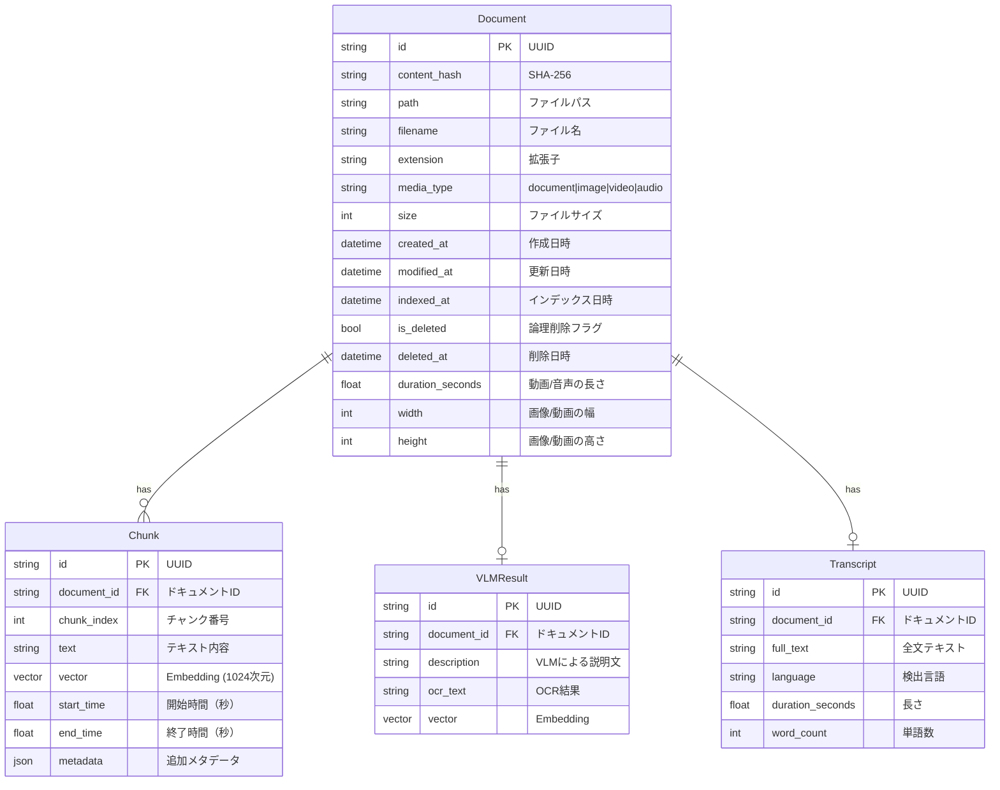

# ER図・データ設計

## ER図



## テーブル詳細

### Document

ファイル情報を管理するメインテーブル。

| カラム | 型 | 説明 |
|--------|-----|------|
| id | UUID | 主キー |
| content_hash | string | SHA-256ハッシュ（先頭64KB + 末尾64KB + サイズ） |
| path | string | ファイルパス |
| filename | string | ファイル名 |
| extension | string | 拡張子 |
| media_type | enum | document, image, video, audio |
| size | int | ファイルサイズ（バイト） |
| created_at | datetime | ファイル作成日時 |
| modified_at | datetime | ファイル更新日時 |
| indexed_at | datetime | インデックス日時 |
| is_deleted | bool | 論理削除フラグ |
| deleted_at | datetime | 削除日時（nullable） |
| duration_seconds | float | 動画/音声の長さ（nullable） |
| width | int | 画像/動画の幅（nullable） |
| height | int | 画像/動画の高さ（nullable） |

### Chunk

テキストチャンクとEmbeddingを格納。

| カラム | 型 | 説明 |
|--------|-----|------|
| id | UUID | 主キー |
| document_id | UUID | 外部キー（Document） |
| chunk_index | int | チャンク番号（0始まり） |
| text | string | テキスト内容 |
| vector | float[1024] | Embedding |
| start_time | float | 開始時間（動画/音声用、nullable） |
| end_time | float | 終了時間（動画/音声用、nullable） |
| metadata | json | 追加メタデータ |

### VLMResult

画像のVLM処理結果を格納。

| カラム | 型 | 説明 |
|--------|-----|------|
| id | UUID | 主キー |
| document_id | UUID | 外部キー（Document） |
| description | string | VLMによる説明文 |
| ocr_text | string | OCR結果（nullable） |
| vector | float[1024] | Embedding |

### Transcript

動画/音声の文字起こし結果を格納。

| カラム | 型 | 説明 |
|--------|-----|------|
| id | UUID | 主キー |
| document_id | UUID | 外部キー（Document） |
| full_text | string | 全文テキスト |
| language | string | 検出言語 |
| duration_seconds | float | 長さ（秒） |
| word_count | int | 単語数 |

## SQLite FTS5（BM25検索用）

```sql
CREATE VIRTUAL TABLE chunks_fts USING fts5(
    chunk_id,
    document_id,
    text,
    path,
    filename,
    content='chunks',
    content_rowid='rowid',
    tokenize='unicode61'
);
```

### トリガー

```sql
CREATE TRIGGER chunks_ai AFTER INSERT ON chunks BEGIN
    INSERT INTO chunks_fts(rowid, chunk_id, document_id, text, path, filename)
    VALUES (new.rowid, new.id, new.document_id, new.text, new.path, new.filename);
END;
```
